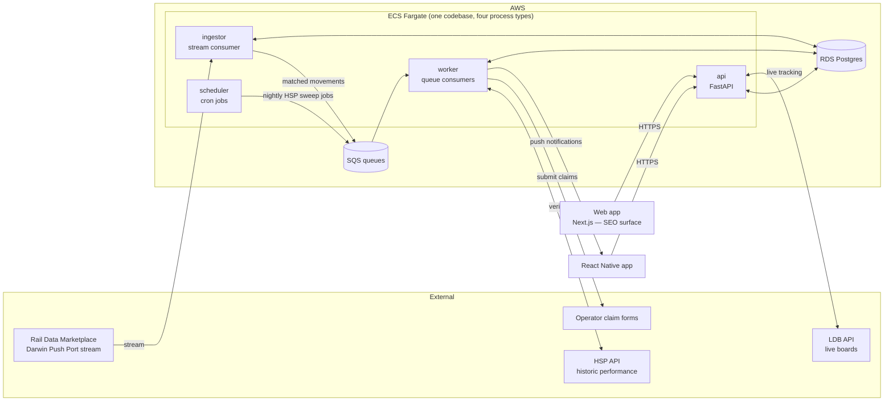
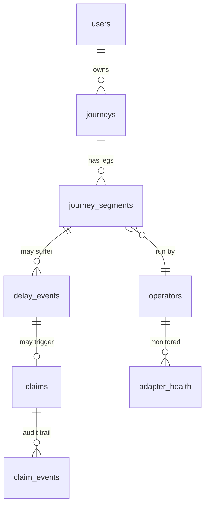

# AutoTrain — Architecture

Companion to [PLAN.md](PLAN.md). This document describes *how* we build it: a **modular monolith** in **Python** on **AWS (Terraform)**, designed so every module can be promoted to its own service when — and only when — load demands it.

The document doubles as a scaling curriculum: each section explains not just the decision but the reasoning pattern behind it, and §8 is an explicit ladder of "at N users, X breaks, so you do Y."

---

## 1. Design principles

1. **Split by workload shape before splitting by domain.** An HTTP API, a long-running stream consumer, and a nightly batch job have different scaling, failure, and deployment characteristics. They are separate *processes* from day one — even though they share one codebase and one database. Domain splits (journeys vs claims) come much later, if ever.
2. **The database is the only thing that's hard to scale. Everything else is stateless.** API containers and workers scale horizontally by turning a dial. Postgres does not. So we spend our up-front design effort on the data model, indexes, and partitioning strategy, and keep every other component free of local state.
3. **Queues between anything that can spike and anything that can be slow.** Delay detection can spike (one signalling failure delays 200 trains at once); claim submission is slow (headless browser, ~30s per claim). A queue between them means spikes are absorbed, not dropped.
4. **Design for at-least-once delivery.** Queues and streams redeliver messages. Every consumer must be idempotent — processing the same message twice must be harmless. This single habit prevents the most common class of distributed-systems bug.
5. **Module boundaries are enforced now, distribution is deferred.** Modules talk to each other only through their public service interface and through domain events. No module touches another module's tables. This is what makes the later monolith → services split a mechanical refactor instead of a rewrite.
6. **Observability before microservices.** You can't operate what you can't see. Structured logs, metrics, and traces are in from week one — they're also how you'll *know* when a scaling step in §8 is actually needed, instead of guessing.

## 2. System overview


**Process**
User adds a ticket and the web or app makes a HTTP call to the API. The API writes a journey to Postgres. Client never interacts with the database, queue or worker (worker takes jobs from the queue). The API sits behind the load balancer so nothing else has any dependency on the internet.

When a train runs late, Darwin streams the information into the ingestor which then checks the message against the monitored services. The messages that aren't discarded go into SQS which the worker reads and figures out whether or not the delay crosses the refundable threshold. The SQS acts a middle man that prevents the worker from being overloaded with information. schedular will sweep jobs onto the queue, and workers will call HSP to check if the arrival was late.

### Two client surfaces, one API

**Web (Next.js) is the primary surface; the mobile app is the notification loop.** They are peers — both are thin clients of the same REST API, and neither owns logic. The split is by what each medium is actually good at:

| | Web (Next.js) | App (React Native) |
|---|---|---|
| **Owns** | Acquisition and trust: server-rendered SEO content ("Delay Repay for *[operator]*", "was my train late?"), the no-login "what am I owed?" calculator, the back-claim flow (typing 28 days of past journeys is a keyboard task), account and claim management, the landing page every shared payout screenshot points at | The magic moment: push notification minutes after a delayed arrival, camera barcode scan, journey list at a glance |
| **Why it must exist** | The only surface search engines can index — the answer to the distribution trap in [MARKET §2a](MARKET.md). Zero install friction for a user standing on a platform, angry, right now. Higher trust for users who won't install an app from an unknown brand | Reliable push is still the one thing the web genuinely can't match (web push is fine on Android/desktop, awkward on iOS outside an installed PWA) |

**Server-rendering is not optional here** — it's the entire point of the web surface. A client-rendered SPA is invisible to search, which would forfeit the channel that justifies building it.

**This is why the OpenAPI decision in ADR-0001 pays off twice:** FastAPI generates the spec, and *both* clients generate typed TypeScript from it. One schema, two clients, no hand-written API types and no drift. It's also why adding a second client doesn't reopen the GraphQL question — the web app renders the same journeys and claims as the phone, so its data needs don't diverge; the trigger for revisiting would be a genuinely different consumer (an ops dashboard, a partner API), not a second view of the same product.

## 3. Module structure (the monolith's internal map)

```
backend/
  src/autotrain/
    modules/
      identity/        # users, auth, devices (push tokens)
      journeys/        # tickets, journeys, matching to scheduled services
      delays/          # delay engine: stream matching, HSP verification, entitlement calc
      claims/          # claim state machine + per-operator adapters
      notifications/   # push/email delivery
    core/
      llm.py           # Anthropic client wrapper: schemas, retries, batch helper (§6a)
      db.py            # psycopg connection pool + transaction helpers
      events.py        # domain event bus (in-process now, SNS/SQS later)
      queue.py         # SQS abstraction (enqueue/consume, idempotency helpers)
      config.py        # pydantic-settings, all config from env vars
      observability.py # structlog, metrics, tracing setup
    api/               # FastAPI routers — thin, delegate to module services
    entrypoints/       # api.py, ingestor.py, worker.py, scheduler.py
  tests/
infra/                 # Terraform (see §7)
web/                   # Next.js — marketing, SEO content, claim calculator, full web app
app/                   # React Native — notification loop, barcode scan
```

**Stack:** FastAPI + Pydantic v2, psycopg 3 with hand-written SQL (no ORM)**, Postgres, `boto3` for SQS, Playwright for form-submission adapters, `uv` for dependency management, `ruff` + `pytest`.

### Boundary rules (enforced, not aspirational)

- Each module exposes a **service layer** (`journeys/service.py`) — its only public API. Other modules import that, never its models or repositories. Enforced with an import-linter contract in CI.
- **No cross-module table access.** If `claims` needs journey data, it calls `journeys.service.get_journey()`. Yes, this is a function call today and would be an HTTP/queue call after a split — that's exactly the point: the call site doesn't change shape.
- **Cross-module reactions happen via domain events**, not direct calls, whenever the reaction is not needed synchronously. `delays` emits `DelayDetected`; `claims` and `notifications` subscribe. The event bus in `core/events.py` is a simple in-process dispatcher today; its interface (`publish(event)`, `subscribe(event_type, handler)`) is designed so the implementation can be swapped for SNS→SQS fan-out without touching business code.


### Data access: hand-written SQL, no ORM

Every database call is SQL we wrote, executed through **psycopg 3**. No ORM sits in between.

**Why, for this system specifically.** The design already leans on Postgres features an ORM abstracts away or fights: monthly partitioning (§4), `INSERT ... ON CONFLICT DO NOTHING` as the idempotency primitive (§4), and — when we reach rung 2 — `FOR UPDATE SKIP LOCKED` if we ever need row-level work claiming. More importantly, the scaling ladder's second rung is *"find the slow query and fix it"*: with hand-written SQL, the statement `pg_stat_statements` reports is character-for-character the statement in the repository file, so `EXPLAIN ANALYZE` maps straight back to code you can edit. With an ORM you first have to work out which Python expression generated it, and the classic ORM failure mode — the accidental N+1, where iterating 200 journeys silently fires 200 queries — cannot occur, because there is no lazy loading to trigger it.

**Where the SQL lives.** Each module keeps its statements in `<module>/repository.py` as named, parameterized constants; anything long or performance-critical (the HSP sweep candidate query, the money-recovered aggregate) goes in `<module>/queries/*.sql` so it can be pasted into `psql` unmodified. The repository is the *only* place SQL appears — never in a service, never in a router. That keeps the blast radius of a schema change to one file per module and preserves the §3 boundary rules unchanged.

**Rows to objects.** psycopg row factories (`class_row`) map result rows directly onto Pydantic models or dataclasses, so a repository returns `Journey`, not an anonymous tuple. Services and routers never see raw rows.

**Migrations** are numbered, hand-written SQL files (`migrations/0001_create_users.sql`, …) applied by a small runner that records what it has applied in a `schema_migrations` table — the same mechanism Alembic and Rails wrap, minus the wrapper. Every migration is forward-only and reviewed as SQL, which is what you actually want when a change rewrites a partitioned table.

**The two disciplines this demands** (both non-negotiable, both enforced in CI):

1. **Parameterized queries, always.** `cur.execute("SELECT … WHERE id = %s", (journey_id,))` — psycopg sends the parameters separately from the statement, so injection is structurally impossible. **Never** build SQL with f-strings or concatenation, not even for an internal-looking value. A lint rule fails any `execute()` call whose first argument isn't a literal.
2. **Integration tests carry the weight the ORM would have.** Nothing statically checks that a query's columns match the dataclass it maps into — so a renamed column becomes a runtime error rather than a type error. The mitigation is that every repository function has a test running against a real Postgres in Docker (§9), so a mismatch fails CI in seconds. This is why the testing pyramid leans heavier on module-service tests than it otherwise would.

**The honest trade:** an ORM would give us schema-change safety (rename a column, and the models layer forces every call site to update) and less boilerplate per query. We're buying explicitness, plan-level control, and Postgres-native features at the price of writing more code and leaning harder on tests. For a system whose correctness bar is "the user checks this number against their bank statement," that's the right side of the trade.

## 4. Data model (the part we design hardest)



Key tables and the scaling-relevant decisions in each:

- **`journeys` / `journey_segments`** — a journey is what the user bought; a segment is one train (multi-leg journeys matter for missed connections later). Each segment stores the matched service identity (RID/UID from Darwin) — matching happens once at creation, so the hot ingest path is a pure lookup. **Partitioned by month on `travel_date`** (Postgres native partitioning): claims are only valid 28 days back, so 99% of queries hit at most two partitions, and archiving old data is a partition detach, not a `DELETE` of millions of rows.
- **`monitored_services`** — the ingestor's filter table: which service IDs (per travel date) does anyone care about right now? This is the trick that makes the firehose cheap (§5). Small, hot, cache-friendly.
- **`delay_events`** — an observed qualifying delay for a segment: minutes late, data source (push-port vs HSP), computed entitlement. Unique on `(journey_segment_id)` — writing one is idempotent, which is what lets the live path and the nightly sweep both fire without double-claiming.
- **`claims`** — a state machine: `detected → eligible → prepared → submitted → acknowledged → paid | rejected | expired`. State transitions are guarded (illegal transitions raise) and every transition appends to **`claim_events`** — an append-only audit log. When an operator disputes a claim, you replay the history.
- **`operators` / `adapter_health`** — operator config (Delay Repay thresholds vary slightly) and per-adapter breakage monitoring (§6).

**Idempotency pattern used throughout:** natural unique keys + `INSERT ... ON CONFLICT DO NOTHING`, and an `idempotency_key` column on anything triggered by a queue message. Redelivered message → conflict → no-op. This is principle #4 made concrete.

## 5. The delay engine — the real scale problem

Darwin Push Port streams *every train movement in Great Britain* — on the order of a few million messages a day. Naive design: evaluate every message against every user journey. Correct design: **filter at the edge, fan out only what matters.**

1. **Ingestor** holds an in-memory set of monitored service IDs (refreshed from `monitored_services` every ~30s — staleness is fine, journeys are added minutes-to-days before travel). Each stream message: parse, check set membership, discard ~99.9%. Matches get pushed to the `delay-evaluation` SQS queue. The ingestor does *no business logic* — it must never fall behind the stream, so it does the minimum possible per message.
2. **Delay-evaluation workers** consume the queue: load the segment, compute lateness at the user's destination, and if it crosses a Delay Repay threshold, write `delay_events` (idempotent) and emit `DelayDetected`.
3. **Nightly HSP sweep** (scheduler → queue → workers): for every segment travelled in the last 3 days without a `delay_event`, query HSP for actual arrival times. This is the correctness backstop — if the ingestor was down for an hour, or a message was missed, the sweep catches it. **Live path = fast, batch path = complete.** The idempotent `delay_events` write is what lets both run without coordination.
4. `DelayDetected` → `claims` creates a claim in `detected` and verifies entitlement against HSP (never file on push-port data alone — it's an estimate; HSP is the record); → `notifications` sends the "You're owed £6.40" push.

> **The lesson:** stream-processing scale is usually won by *reducing* work, not parallelising it. Filter as early and cheaply as possible; only fan out the survivors. The second lesson is the fast-but-lossy path paired with a slow-but-complete reconciliation job — this pattern (real-time + nightly reconciliation) appears in payments, analytics, and inventory systems everywhere.

## 6. Claims — queues as shock absorbers, adapters as a firebreak

Claim submission is everything the delay engine isn't: slow (headless browser driving an operator's form, ~30s), flaky (operator sites go down, forms change), and rate-sensitive (we submit at human speed, deliberately).

- Every operator gets an **adapter** implementing one interface: `prepare(claim) -> PreparedClaim` and either `deep_link()` (v1: pre-filled form URL for the user) or `submit()` (v2: server-side Playwright submission). Adapters are registry-loaded per operator code — adding an operator touches nothing outside its adapter.
- Submission runs on a **dedicated `claim-submission` queue** with its own worker pool, separate from delay evaluation. A flood of delays never blocks submissions and vice versa; each queue scales on its own depth. Per-operator rate limiting lives in the worker.
- **Failure policy:** retry with exponential backoff; after N failures the claim parks in `prepared` with an alert, and the user gets the deep-link fallback — degraded, never dropped. Every adapter run records success/failure in `adapter_health`; a failure-rate spike on one operator pages you *before* users notice. The plan calls adapters "the moat and the treadmill" — `adapter_health` is the treadmill's dashboard.

> **The lesson:** isolate the unreliable thing. Third-party integrations get their own queue, their own retry policy, their own health metrics, and a designed fallback. The blast radius of Avanti changing their form is one adapter's error rate — not the product.

## 6a. AI at the boundaries — the Soar pattern

Two existence proofs shape this section. **Soar** (flysoar.ai), the AI travel app, gets its "magic" feel from one architectural move: connect the user's Gmail, have an LLM parse every travel confirmation into structured trip data, then run proactive alerts on top — AI does the *messy ingestion and interface*, while flight data and booking stay deterministic underneath. And the tweet that seeded AutoTrain ([Owen Greenhalgh's Codex agent](MARKET.md#0a-proof-it-works-at-n1--the-origin-tweet)) proves the same pattern closes the full loop for rail: an LLM agent reading raw ticket emails, checking arrivals, and filing Delay Repay claims that actually pay out.

We adopt the same division of labor: **LLMs at the messy-input boundaries, deterministic code everywhere money is computed.**

### Where AutoTrain calls Claude

| Call site | Module | What the LLM does | What guards it |
|---|---|---|---|
| **Ticket ingestion** (email-forward now, Gmail connect later) | `journeys` | Extract structured journey data (origin, destination, date/time, operator, price in pence, ticket type, retailer) from *any* retailer's confirmation email — replacing N hand-written, brittle per-retailer parsers with one extraction call that generalizes to retailers we've never seen | Schema-validated output; station/operator names resolved against reference data; low-confidence extractions routed to a manual-review queue, never silently accepted |
| **Claim-status emails** | `claims` | Classify operator replies (acknowledged / paid / rejected) and extract amount + rejection reason | Feeds the *guarded* claim state machine — an extraction can propose a transition, only valid transitions execute; `paid` amounts cross-checked against the computed entitlement |
| **Adapter repair assist** | dev tooling | When `adapter_health` alarms on a changed operator form, draft the new field mapping from the fetched form HTML | Human-reviewed PR — never auto-deployed |

**The hard rule: no LLM in the money path.** Delay verification (HSP actuals), entitlement calculation (pure functions, integer pence), and claim-state transitions are deterministic. LLM output is treated like user input — untrusted until validated. Every extraction stores the raw email alongside the structured result, so disputes are auditable and extraction bugs are replayable.

### Implementation notes

- **Python `anthropic` SDK**, wrapped once in `core/llm.py`. Extraction uses structured outputs — `client.messages.parse()` with a Pydantic schema — so responses are validated objects, not JSON hoping. Model: `claude-opus-5` by default; if volume makes cost material, benchmark cheaper tiers against the eval set (below) before switching — that's a measured decision, not a default.
- **Batches API for anything non-urgent.** The nightly claim-status sweep and backfill parsing run through message batches at 50% of standard price. Urgent-path parsing (a just-forwarded ticket) uses regular calls.
- **Prompt caching** on the static extraction instructions (they're identical across every email), so per-call cost is dominated by the email itself. Ballpark: ~1–2p per email parsed, halved in batch — far cheaper than maintaining a per-retailer parser fleet, and it improves coverage instead of degrading it.
- **Evals as contract tests.** A fixture set of real ticket and status emails lives in the repo; CI runs extraction against it and fails on accuracy regression — the same discipline as adapter contract tests (§6). The MARKET.md parser-hit-rate KPI is measured from production extractions falling back to manual review.
- **Scaling shape:** LLM calls are just another slow external I/O, so they follow the house rules — behind queues, idempotent, rate-limit-aware. Nothing about them changes the scaling ladder.

> **The lesson:** the winning use of LLMs in a system like this is *unstructured-in, structured-out at the edges* — it converts the historically hard problem (every retailer formats email differently; every operator writes rejections differently) into one general capability, while the core stays testable and deterministic. AI as ingestion layer, not decision layer.

## 7. AWS infrastructure (Terraform)

```
infra/
  modules/          # reusable: network, ecs-service, rds, sqs-queue, ...
  envs/
    staging/        # small instances, same shape as prod
    prod/
```

| Concern | Choice | Why this and not more |
|---|---|---|
| Compute | ECS **Fargate**, one service per process type | Containers without managing EC2 or Kubernetes. Autoscaling: `api` on CPU, `worker` on SQS queue depth — the two scaling signals worth learning first. |
| Database | RDS Postgres, Multi-AZ in prod, `db.t4g.micro` to start | Managed backups/failover. One instance until §8 says otherwise. |
| Queues | SQS + one dead-letter queue per queue | DLQs are non-negotiable: a poison message retries N times then parks for inspection instead of blocking the queue forever. |
| Ingress | ALB → `api` only | Ingestor/workers/scheduler have no inbound network exposure at all. |
| Network | VPC: public subnets (ALB) / private (ECS, RDS) | Standard pattern; DB is unreachable from the internet. |
| Secrets | SSM Parameter Store | Free tier, injected into tasks as env vars. Secrets Manager only if rotation is needed later. |
| CI/CD | GitHub Actions: test → build image → ECR → deploy staging → manual gate → prod | Every deploy is the same artifact promoted through environments. |
| Observability | CloudWatch logs (structured JSON via `structlog`), CloudWatch metrics + alarms (queue depth, DLQ non-empty, adapter failure rate, p95 latency), Sentry for exceptions | Alarms on the *leading* indicators: queue depth growth tells you workers are underwater before users feel it. |

Estimated cost at MVP scale: **~£30–60/month** (Fargate min tasks + micro RDS + ALB). Staging identical in shape, smaller in size — environment parity is itself a scaling lesson: config differs, architecture never does.

## 8. The scaling ladder — what breaks, when, and what you do

The most important table in this document. **Nothing on rung N+1 is built until a rung-N metric says so.** Premature scaling costs real complexity to solve imaginary load.

| Rung | Signal you've reached it | What's breaking | What you change |
|---|---|---|---|
| **0 — MVP** (0–10k users) | — | — | Everything above: 4 process types × 1–2 tasks, one micro Postgres. This shape survives to ~10k users untouched. |
| **1 — Worker saturation** | `delay-evaluation` queue depth grows during disruption spikes | One big incident delays hundreds of monitored trains at once | Turn the autoscaling dial: more worker tasks on queue depth. Stateless workers = this is config, not code. First proof the queue design paid off. |
| **2 — DB read pressure** (~50k users) | RDS CPU high; p95 API latency rising; slow-query log fills | App-driven reads (journey lists, claim status, "money recovered") swamp the primary | In order of cheapness: add missing indexes and rewrite the worst queries — `pg_stat_statements` ranks them by total time, and because the SQL is hand-written the offending statement maps straight to a line in a repository file you can `EXPLAIN ANALYZE` and edit; cache hot reads (ElastiCache Redis — "money recovered" doesn't need per-request recomputation); **then** a read replica, routing read-only sessions to it. Replica lag now exists — the app must tolerate slightly-stale reads. |
| **3 — Write pressure & table bloat** (~200k users) | Write IOPS climbing; partition sizes large; vacuum struggles | Millions of journey rows; delay-event writes contending with app traffic | Bigger instance (vertical scaling is unfashionable and *correct* — buy years for money before buying complexity). Monthly partitioning (already in place since §4) keeps working sets small; detach-and-archive partitions past the 28-day window to S3. |
| **4 — First real service split** (~500k users) | Delay-engine deploys risk claim submission; teams (or you) trip over shared release cadence; ingest CPU profile diverges hard from API | The monolith's *deployment unit* is now the bottleneck, not its performance | Promote `delays` (ingestor + evaluation workers) to its own service. Because of §3's rules this is mechanical: its tables move to its own schema/database, the in-process event bus becomes SNS→SQS fan-out (`core/events.py` swaps implementation), and `journeys.service` calls become a thin internal API. Split **along the event seam**, where coupling is already async. |
| **5 — Beyond** (1M+) | Depends what hurts | — | More splits along module seams if and where needed; Postgres logical sharding by user only if a single primary truly can't cope (it copes far longer than people expect); multi-region only if UK-only latency somehow matters. Each step: driven by a measured signal, never by architecture fashion. |

> **The meta-lesson:** scaling is a sequence of *observed bottleneck → cheapest adequate fix*, not a destination architecture. The design work we did up front (stateless compute, queues, module boundaries, partitioned tables, idempotency) isn't premature scaling — it's what makes every rung above a small move instead of a rewrite. That's the difference between "built for scale" and "built at scale": you don't pre-build the skyscraper, you pre-build the foundations that don't require demolition.

## 9. Cross-cutting decisions

- **Auth:** email magic-link + JWT access/refresh (no passwords to breach). Device table stores push tokens.
- **Money:** integer pence everywhere. Never floats. Entitlement calculations are pure functions with exhaustive unit tests — this is the number users will check.
- **Time:** UTC in the database, Europe/London only at render time. Rail data timezone bugs are legion; one rule prevents them.
- **PII & GDPR:** ticket images in S3 (SSE, lifecycle-deleted after claim window + dispute buffer); user deletion = hard delete of PII, claims history anonymised (audit trail survives, identity doesn't).
- **Testing pyramid:** pure-function unit tests (entitlement calc, claim state machine) → **repository + module-service tests against real Postgres in Docker** → a handful of end-to-end API tests → adapter contract tests that replay recorded operator-form fixtures (so a form change fails CI, not production). The middle layer is deliberately heavy: with hand-written SQL there is no ORM checking that a query's columns match the object it maps into, so every repository function is covered by a test that actually executes it. Never mock the database — a mocked query proves nothing about whether the SQL is valid.

## 10. Build order (revised Phase 1, per PLAN.md §8)

1. Repo scaffold: module skeleton, `core/` (config, db pool, events, queue), the SQL migration runner + first migrations, CI, Terraform for staging (VPC, RDS, one ECS service).
2. `journeys` module + HSP client: CLI answering *"was this journey late and what's it owed?"* — the delay-engine proof, now inside its final home rather than as throwaway code.
3. `delays` module: entitlement calculator (pure, tested to death) + nightly HSP sweep. **The sweep alone — no live stream — is a complete, correct MVP delay engine.**
4. Ingestor + Push Port stream (the real-time upgrade).
5. `claims` state machine + first deep-link adapters; then the app.
