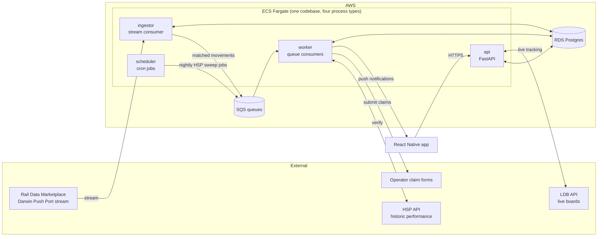
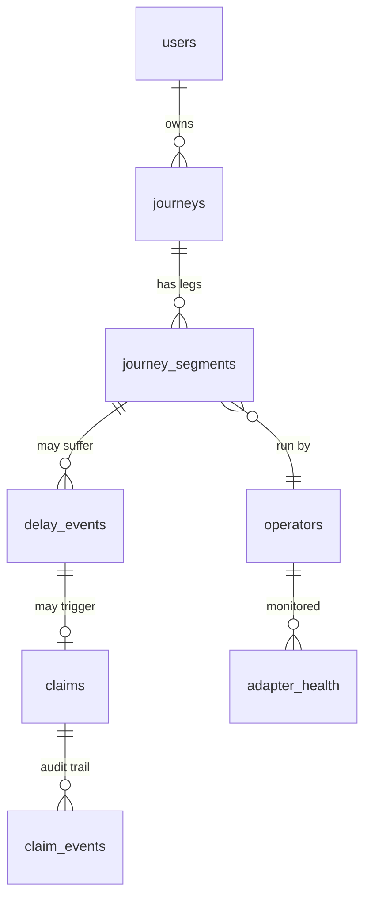

# AutoTrain — Architecture

Companion to [PLAN.md](PLAN.md). This document describes *how* we build it: a **modular monolith** in **Python** on **AWS (Terraform)**, designed so every module can be promoted to its own service when — and only when — load demands it.

The document doubles as a scaling curriculum: each section explains not just the decision but the reasoning pattern behind it, and §8 is an explicit ladder of "at N users, X breaks, so you do Y."

---

## 1. Design principles

1. **Split by workload shape before splitting by domain.** An HTTP API, a long-running stream consumer, and a nightly batch job have different scaling, failure, and deployment characteristics. They are separate *processes* from day one — even though they share one codebase and one database. Domain splits (journeys vs claims) come much later, if ever.
2. **The database is the only thing that's hard to scale. Everything else is stateless.** API containers and workers scale horizontally by turning a dial. Postgres does not. So we spend our up-front design effort on the data model, indexes, and partitioning strategy, and keep every other component free of local state.
3. **Queues between anything that can spike and anything that can be slow.** Delay detection can spike (one signalling failure delays 200 trains at once); claim submission is slow (headless browser, ~30s per claim). A queue between them means spikes are absorbed, not dropped.
4. **Design for at-least-once delivery.** Queues and streams redeliver messages. Every consumer must be idempotent — processing the same message twice must be harmless. This single habit prevents the most common class of distributed-systems bug.
5. **Module boundaries are enforced now, distribution is deferred.** Modules talk to each other only through their public service interface and through domain events. No module touches another module's tables. This is what makes the later monolith → services split a mechanical refactor instead of a rewrite.
6. **Observability before microservices.** You can't operate what you can't see. Structured logs, metrics, and traces are in from week one — they're also how you'll *know* when a scaling step in §8 is actually needed, instead of guessing.

## 2. System overview



Four process types, one Docker image, one repository, one database:

| Process | Workload shape | Scales on |
|---|---|---|
| `api` | Request/response, latency-sensitive | Request rate (CPU) |
| `ingestor` | Long-running stream consumer, must never fall behind | Stream volume (usually 1–2 instances, it mostly *filters*) |
| `worker` | Queue consumers: delay evaluation, claim submission, notifications | Queue depth |
| `scheduler` | Cron: nightly HSP sweep, adapter health checks, claim-status polling | Fixed (1 instance; it only *enqueues* work) |

They run the same image with a different entry command (`api`, `ingestor`, `worker --queue=...`, `scheduler`). This is the cheapest possible version of "separate services": independent scaling and isolation of failures, zero code duplication, no inter-service networking to build.

## 3. Module structure (the monolith's internal map)

```
backend/
  src/autotrain/
    modules/
      identity/        # users, auth, devices (push tokens)
      journeys/        # tickets, journeys, matching to scheduled services
      delays/          # delay engine: stream matching, HSP verification, entitlement calc
      claims/          # claim state machine + per-operator adapters
      notifications/   # push/email delivery
    core/
      db.py            # SQLAlchemy engine/session
      events.py        # domain event bus (in-process now, SNS/SQS later)
      queue.py         # SQS abstraction (enqueue/consume, idempotency helpers)
      config.py        # pydantic-settings, all config from env vars
      observability.py # structlog, metrics, tracing setup
    api/               # FastAPI routers — thin, delegate to module services
    entrypoints/       # api.py, ingestor.py, worker.py, scheduler.py
  tests/
infra/                 # Terraform (see §7)
app/                   # React Native (phase 2)
```

**Stack:** FastAPI + Pydantic v2, SQLAlchemy 2.0 + Alembic migrations, Postgres, `boto3` for SQS, Playwright for form-submission adapters, `uv` for dependency management, `ruff` + `pytest`.

### Boundary rules (enforced, not aspirational)

- Each module exposes a **service layer** (`journeys/service.py`) — its only public API. Other modules import that, never its models or repositories. Enforced with an import-linter contract in CI.
- **No cross-module table access.** If `claims` needs journey data, it calls `journeys.service.get_journey()`. Yes, this is a function call today and would be an HTTP/queue call after a split — that's exactly the point: the call site doesn't change shape.
- **Cross-module reactions happen via domain events**, not direct calls, whenever the reaction is not needed synchronously. `delays` emits `DelayDetected`; `claims` and `notifications` subscribe. The event bus in `core/events.py` is a simple in-process dispatcher today; its interface (`publish(event)`, `subscribe(event_type, handler)`) is designed so the implementation can be swapped for SNS→SQS fan-out without touching business code.

> **The lesson:** microservices' real value is *enforced boundaries and independent scaling*, and you can get the first one for free inside a monolith. Teams that skip the boundaries and jump straight to services get a distributed monolith — all of the operational cost, none of the benefit.

## 4. Data model (the part we design hardest)



Key tables and the scaling-relevant decisions in each:

- **`journeys` / `journey_segments`** — a journey is what the user bought; a segment is one train (multi-leg journeys matter for missed connections later). Each segment stores the matched service identity (RID/UID from Darwin) — matching happens once at creation, so the hot ingest path is a pure lookup. **Partitioned by month on `travel_date`** (Postgres native partitioning): claims are only valid 28 days back, so 99% of queries hit at most two partitions, and archiving old data is a partition detach, not a `DELETE` of millions of rows.
- **`monitored_services`** — the ingestor's filter table: which service IDs (per travel date) does anyone care about right now? This is the trick that makes the firehose cheap (§5). Small, hot, cache-friendly.
- **`delay_events`** — an observed qualifying delay for a segment: minutes late, data source (push-port vs HSP), computed entitlement. Unique on `(journey_segment_id)` — writing one is idempotent, which is what lets the live path and the nightly sweep both fire without double-claiming.
- **`claims`** — a state machine: `detected → eligible → prepared → submitted → acknowledged → paid | rejected | expired`. State transitions are guarded (illegal transitions raise) and every transition appends to **`claim_events`** — an append-only audit log. When an operator disputes a claim, you replay the history.
- **`operators` / `adapter_health`** — operator config (Delay Repay thresholds vary slightly) and per-adapter breakage monitoring (§6).

**Idempotency pattern used throughout:** natural unique keys + `INSERT ... ON CONFLICT DO NOTHING`, and an `idempotency_key` column on anything triggered by a queue message. Redelivered message → conflict → no-op. This is principle #4 made concrete.

## 5. The delay engine — the real scale problem

Darwin Push Port streams *every train movement in Great Britain* — on the order of a few million messages a day. Naive design: evaluate every message against every user journey. Correct design: **filter at the edge, fan out only what matters.**

1. **Ingestor** holds an in-memory set of monitored service IDs (refreshed from `monitored_services` every ~30s — staleness is fine, journeys are added minutes-to-days before travel). Each stream message: parse, check set membership, discard ~99.9%. Matches get pushed to the `delay-evaluation` SQS queue. The ingestor does *no business logic* — it must never fall behind the stream, so it does the minimum possible per message.
2. **Delay-evaluation workers** consume the queue: load the segment, compute lateness at the user's destination, and if it crosses a Delay Repay threshold, write `delay_events` (idempotent) and emit `DelayDetected`.
3. **Nightly HSP sweep** (scheduler → queue → workers): for every segment travelled in the last 3 days without a `delay_event`, query HSP for actual arrival times. This is the correctness backstop — if the ingestor was down for an hour, or a message was missed, the sweep catches it. **Live path = fast, batch path = complete.** The idempotent `delay_events` write is what lets both run without coordination.
4. `DelayDetected` → `claims` creates a claim in `detected` and verifies entitlement against HSP (never file on push-port data alone — it's an estimate; HSP is the record); → `notifications` sends the "You're owed £6.40" push.

> **The lesson:** stream-processing scale is usually won by *reducing* work, not parallelising it. Filter as early and cheaply as possible; only fan out the survivors. The second lesson is the fast-but-lossy path paired with a slow-but-complete reconciliation job — this pattern (real-time + nightly reconciliation) appears in payments, analytics, and inventory systems everywhere.

## 6. Claims — queues as shock absorbers, adapters as a firebreak

Claim submission is everything the delay engine isn't: slow (headless browser driving an operator's form, ~30s), flaky (operator sites go down, forms change), and rate-sensitive (we submit at human speed, deliberately).

- Every operator gets an **adapter** implementing one interface: `prepare(claim) -> PreparedClaim` and either `deep_link()` (v1: pre-filled form URL for the user) or `submit()` (v2: server-side Playwright submission). Adapters are registry-loaded per operator code — adding an operator touches nothing outside its adapter.
- Submission runs on a **dedicated `claim-submission` queue** with its own worker pool, separate from delay evaluation. A flood of delays never blocks submissions and vice versa; each queue scales on its own depth. Per-operator rate limiting lives in the worker.
- **Failure policy:** retry with exponential backoff; after N failures the claim parks in `prepared` with an alert, and the user gets the deep-link fallback — degraded, never dropped. Every adapter run records success/failure in `adapter_health`; a failure-rate spike on one operator pages you *before* users notice. The plan calls adapters "the moat and the treadmill" — `adapter_health` is the treadmill's dashboard.

> **The lesson:** isolate the unreliable thing. Third-party integrations get their own queue, their own retry policy, their own health metrics, and a designed fallback. The blast radius of Avanti changing their form is one adapter's error rate — not the product.

## 7. AWS infrastructure (Terraform)

```
infra/
  modules/          # reusable: network, ecs-service, rds, sqs-queue, ...
  envs/
    staging/        # small instances, same shape as prod
    prod/
```

| Concern | Choice | Why this and not more |
|---|---|---|
| Compute | ECS **Fargate**, one service per process type | Containers without managing EC2 or Kubernetes. Autoscaling: `api` on CPU, `worker` on SQS queue depth — the two scaling signals worth learning first. |
| Database | RDS Postgres, Multi-AZ in prod, `db.t4g.micro` to start | Managed backups/failover. One instance until §8 says otherwise. |
| Queues | SQS + one dead-letter queue per queue | DLQs are non-negotiable: a poison message retries N times then parks for inspection instead of blocking the queue forever. |
| Ingress | ALB → `api` only | Ingestor/workers/scheduler have no inbound network exposure at all. |
| Network | VPC: public subnets (ALB) / private (ECS, RDS) | Standard pattern; DB is unreachable from the internet. |
| Secrets | SSM Parameter Store | Free tier, injected into tasks as env vars. Secrets Manager only if rotation is needed later. |
| CI/CD | GitHub Actions: test → build image → ECR → deploy staging → manual gate → prod | Every deploy is the same artifact promoted through environments. |
| Observability | CloudWatch logs (structured JSON via `structlog`), CloudWatch metrics + alarms (queue depth, DLQ non-empty, adapter failure rate, p95 latency), Sentry for exceptions | Alarms on the *leading* indicators: queue depth growth tells you workers are underwater before users feel it. |

Estimated cost at MVP scale: **~£30–60/month** (Fargate min tasks + micro RDS + ALB). Staging identical in shape, smaller in size — environment parity is itself a scaling lesson: config differs, architecture never does.

## 8. The scaling ladder — what breaks, when, and what you do

The most important table in this document. **Nothing on rung N+1 is built until a rung-N metric says so.** Premature scaling costs real complexity to solve imaginary load.

| Rung | Signal you've reached it | What's breaking | What you change |
|---|---|---|---|
| **0 — MVP** (0–10k users) | — | — | Everything above: 4 process types × 1–2 tasks, one micro Postgres. This shape survives to ~10k users untouched. |
| **1 — Worker saturation** | `delay-evaluation` queue depth grows during disruption spikes | One big incident delays hundreds of monitored trains at once | Turn the autoscaling dial: more worker tasks on queue depth. Stateless workers = this is config, not code. First proof the queue design paid off. |
| **2 — DB read pressure** (~50k users) | RDS CPU high; p95 API latency rising; slow-query log fills | App-driven reads (journey lists, claim status, "money recovered") swamp the primary | In order of cheapness: fix N+1s and add missing indexes (`pg_stat_statements` tells you which); cache hot reads (ElastiCache Redis — "money recovered" doesn't need per-request recomputation); **then** a read replica, routing read-only sessions to it. Replica lag now exists — the app must tolerate slightly-stale reads. |
| **3 — Write pressure & table bloat** (~200k users) | Write IOPS climbing; partition sizes large; vacuum struggles | Millions of journey rows; delay-event writes contending with app traffic | Bigger instance (vertical scaling is unfashionable and *correct* — buy years for money before buying complexity). Monthly partitioning (already in place since §4) keeps working sets small; detach-and-archive partitions past the 28-day window to S3. |
| **4 — First real service split** (~500k users) | Delay-engine deploys risk claim submission; teams (or you) trip over shared release cadence; ingest CPU profile diverges hard from API | The monolith's *deployment unit* is now the bottleneck, not its performance | Promote `delays` (ingestor + evaluation workers) to its own service. Because of §3's rules this is mechanical: its tables move to its own schema/database, the in-process event bus becomes SNS→SQS fan-out (`core/events.py` swaps implementation), and `journeys.service` calls become a thin internal API. Split **along the event seam**, where coupling is already async. |
| **5 — Beyond** (1M+) | Depends what hurts | — | More splits along module seams if and where needed; Postgres logical sharding by user only if a single primary truly can't cope (it copes far longer than people expect); multi-region only if UK-only latency somehow matters. Each step: driven by a measured signal, never by architecture fashion. |

> **The meta-lesson:** scaling is a sequence of *observed bottleneck → cheapest adequate fix*, not a destination architecture. The design work we did up front (stateless compute, queues, module boundaries, partitioned tables, idempotency) isn't premature scaling — it's what makes every rung above a small move instead of a rewrite. That's the difference between "built for scale" and "built at scale": you don't pre-build the skyscraper, you pre-build the foundations that don't require demolition.

## 9. Cross-cutting decisions

- **Auth:** email magic-link + JWT access/refresh (no passwords to breach). Device table stores push tokens.
- **Money:** integer pence everywhere. Never floats. Entitlement calculations are pure functions with exhaustive unit tests — this is the number users will check.
- **Time:** UTC in the database, Europe/London only at render time. Rail data timezone bugs are legion; one rule prevents them.
- **PII & GDPR:** ticket images in S3 (SSE, lifecycle-deleted after claim window + dispute buffer); user deletion = hard delete of PII, claims history anonymised (audit trail survives, identity doesn't).
- **Testing pyramid:** pure-function unit tests (entitlement calc, claim state machine) → module-service tests against real Postgres in Docker → a handful of end-to-end API tests → adapter contract tests that replay recorded operator-form fixtures (so a form change fails CI, not production).

## 10. Build order (revised Phase 1, per PLAN.md §8)

1. Repo scaffold: module skeleton, `core/` (config, db, events, queue), CI, Terraform for staging (VPC, RDS, one ECS service).
2. `journeys` module + HSP client: CLI answering *"was this journey late and what's it owed?"* — the delay-engine proof, now inside its final home rather than as throwaway code.
3. `delays` module: entitlement calculator (pure, tested to death) + nightly HSP sweep. **The sweep alone — no live stream — is a complete, correct MVP delay engine.**
4. Ingestor + Push Port stream (the real-time upgrade).
5. `claims` state machine + first deep-link adapters; then the app.
